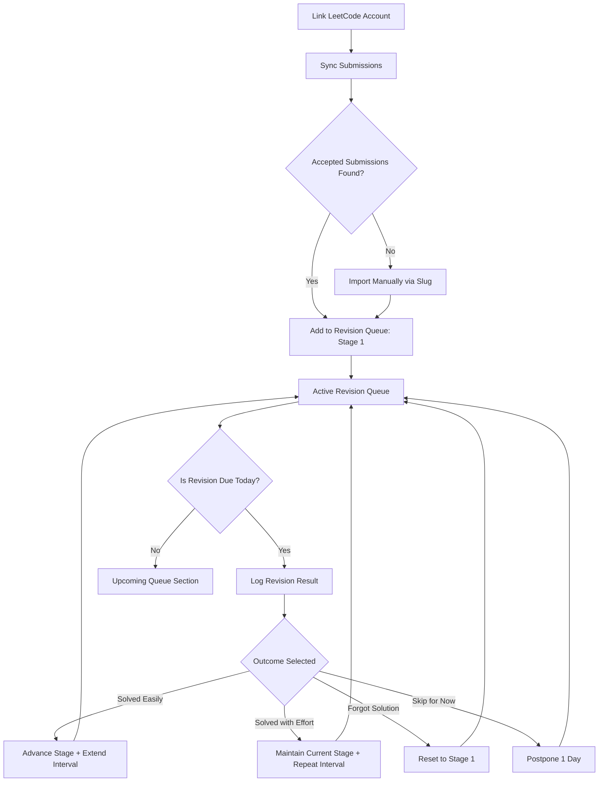
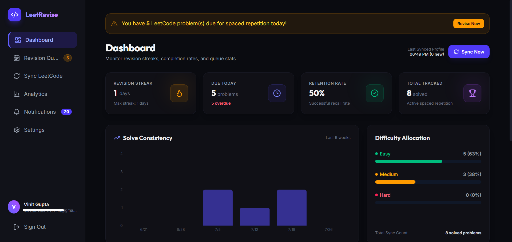
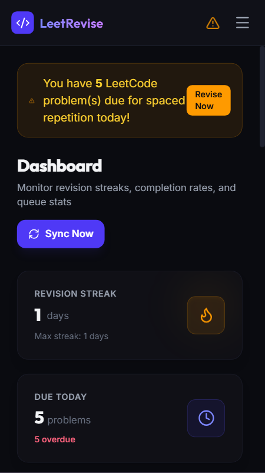
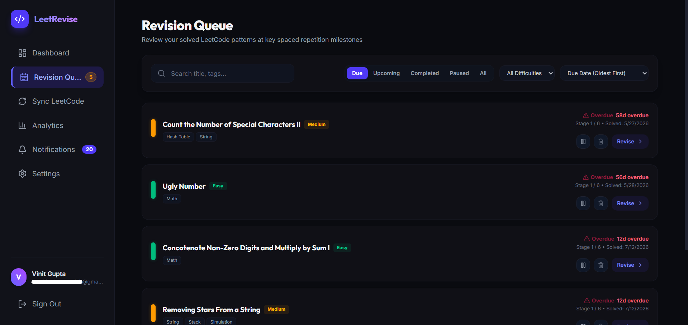
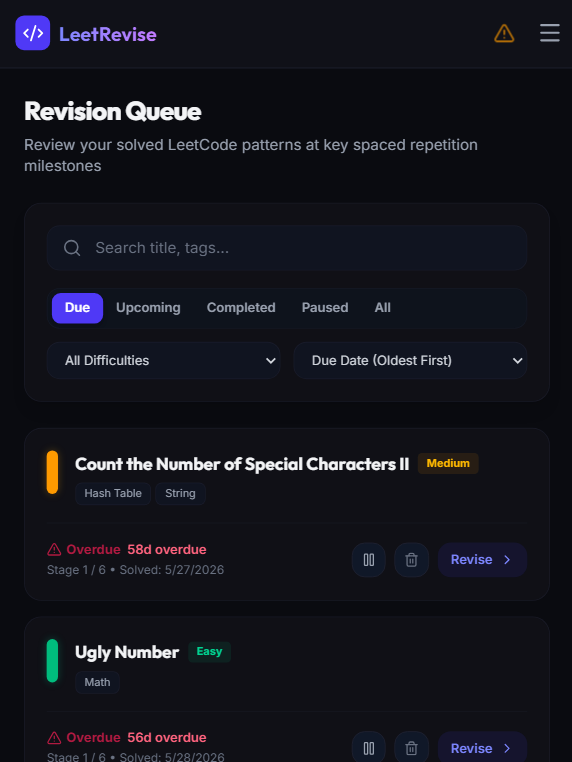
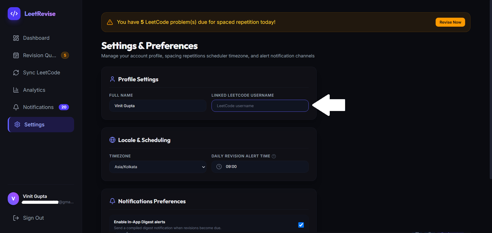
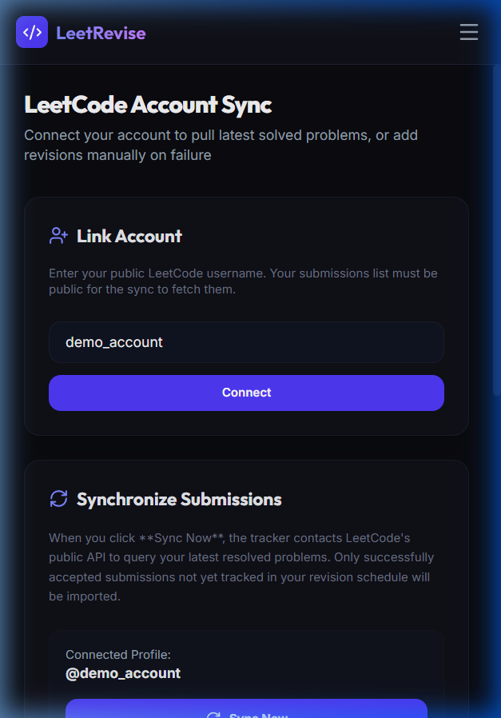
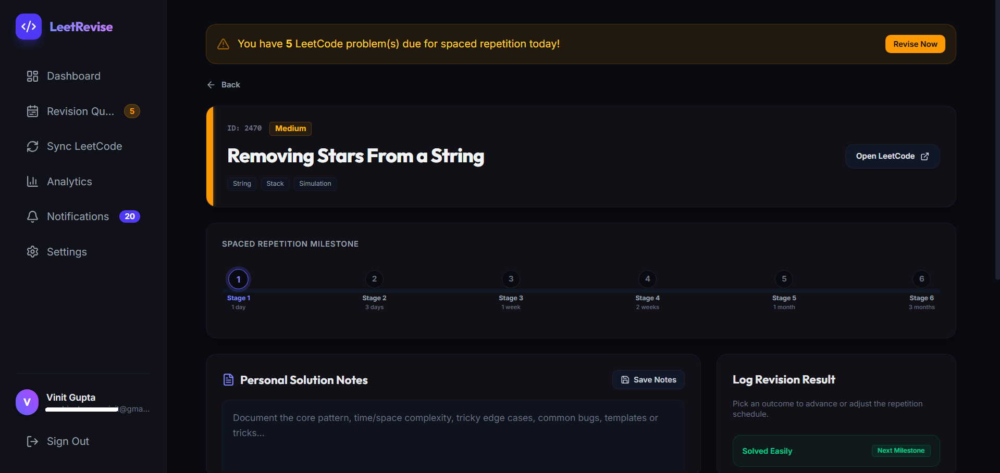
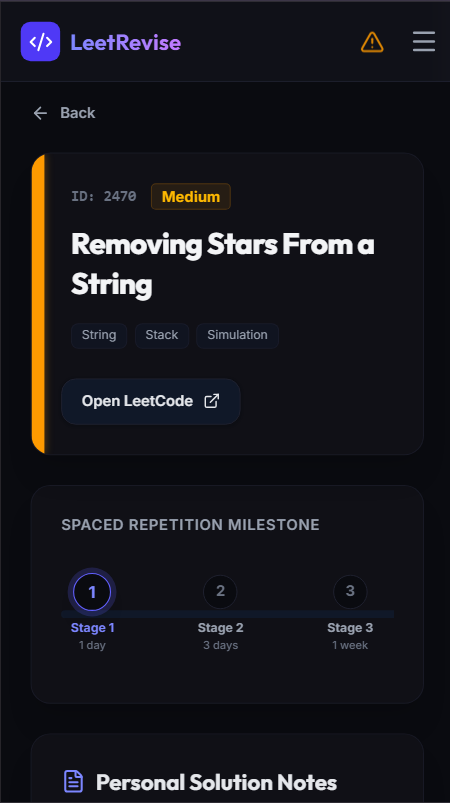

# LeetRevise

LeetRevise is a personal Fullstack productivity web application designed to help software engineers retain solved LeetCode problems long-term using Spaced Repetition.

Rather than re-learning complex algorithm solutions from scratch, LeetRevise tracks your submissions, automatically places solved problems into an adaptive milestone review queue, and alerts you when it is time to revise.

---

## The Core Problem & Solution

* **The Problem:** Software engineers solve hundreds of LeetCode problems but forget the core solution patterns (graphs, dynamic programming templates, tree traversals) after a few weeks.
* **The Solution:** LeetRevise introduces an adaptive spaced repetition schedule (Stages 1 through 6). By reviewing the patterns at increasing time intervals (1 day, 3 days, 1 week, etc.), solutions are reinforced and committed to long-term memory with minimal revision effort.

---

## End-to-End Revision Workflow

Here is how LeetRevise coordinates your spaced repetition schedule:



### 1. Synchronizing Submissions
* **Account Linking:** Link your public LeetCode username on the Sync Account page.
* **Auto-Sync:** LeetRevise calls LeetCode's public GraphQL API to fetch your recent accepted solutions.
* **Manual Import Fallback:** If LeetCode rate limits the API or a solution is old, users can input the problem's slug (e.g. `two-sum`) or URL to manually resolve details and append it to the queue.

### 2. The Active Revision Queue
* Items are sorted as a priority queue based on their calculated `nextReviewAt` timestamp.
* Problems currently due or overdue show up at the top of the list with a visible alarm indicator.

### 3. Reviewing a Solution
* Clicking "Revise" takes you to the Problem Detail page.
* Read/write custom markdown notes to detail the solution pattern, tricky edge cases, and time/space complexity.
* Click "Open LeetCode" to head directly to the editor on LeetCode.

### 4. Logging Outcomes (Interval Scheduling)
Upon testing yourself, record one of these results to automatically compute the next milestone:
* **Solved Easily:** Advances the problem to the next stage (Stage 1 to Stage 2) and increases the revision interval (e.g., from 1 day to 3 days).
* **Solved with Effort:** Retains your current stage and schedules another check for the same interval.
* **Forgot Solution:** Resets the problem milestone back to Stage 1 (1 day review interval) to rebuild recall.
* **Skip for Now:** Postpones the review by 1 day.

---

## Screen Previews & Interface

### Dashboard View
The dashboard tracks consistency streaks, completion rates, and active queue counts.

* **Desktop View:**
  

* **Mobile View:**
  <p align="left">
    
  </p>

### Revision Queue
Priority-sorted queue displaying problems due or overdue.

* **Desktop View:**
  

* **Mobile View:**
  <p align="left">
    
  </p>

### LeetCode Sync Account
Link your public profile or import solved problem slugs manually.

* **Desktop View:**
  

* **Mobile View:**
  <p align="left">
    
  </p>

### Problem Details & solution logging
Visual milestone stages progress stepper and Solution Notes editor.

* **Desktop View:**
  

* **Mobile View:**
  <p align="left">
    
  </p>

---

## Local Development Setup

To run LeetRevise locally:

### Prerequisites
* Node.js (v18+)
* npm

### Installation Steps

1. **Clone the repository:**
   ```bash
   git clone https://github.com/YOUR_USERNAME/LeetRevise.git
   cd LeetRevise
   ```

2. **Install all dependencies concurrently:**
   ```bash
   npm run install:all
   ```

3. **Configure Environment Variables:**
   Create a `.env` file in the `server` directory:
   ```env
   DATABASE_URL="file:./dev.db"
   PORT=5000
   JWT_SECRET="your-development-jwt-secret-key-12345!"
   NODE_ENV="development"
   ```

4. **Initialize Local SQLite Database:**
   ```bash
   cd server
   npx prisma db push
   cd ..
   ```

5. **Start Dev Servers (Frontend + Backend Concurrently):**
   ```bash
   npm run dev
   ```
   * Frontend: http://localhost:5173
   * Backend: http://localhost:5000

---

## Production Deployment Reference

### 1. Database (Neon)
* Create a Serverless Postgres instance on Neon.tech.
* Run `npx prisma db push` with your Neon database string to instantiate tables.

### 2. Backend API (Render)
* Host the `server` directory as a Node Web Service on Render.com.
* Config environment variables: `DATABASE_URL` (pooled connection), `DIRECT_DATABASE_URL` (direct connection), `JWT_SECRET`, `NODE_ENV=production`.

### 3. Frontend SPA (Vercel)
* Deploy the `client` directory on Vercel.com with framework preset Vite.
* Vercel uses the `vercel.json` rewrite file to ensure React Router client paths route to `index.html` on browser reloads.
